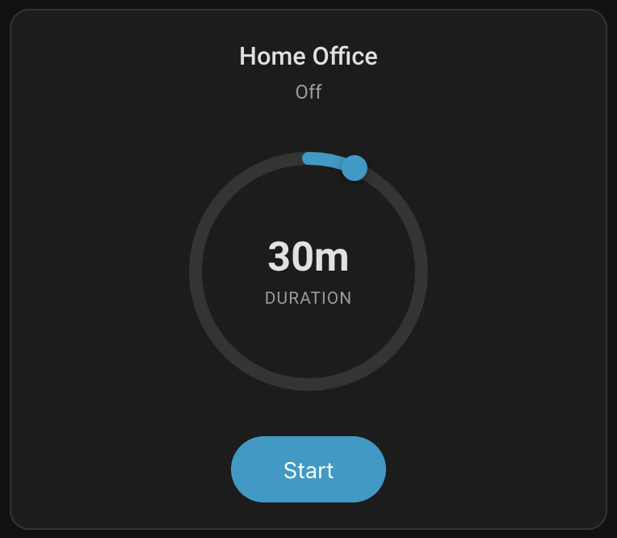
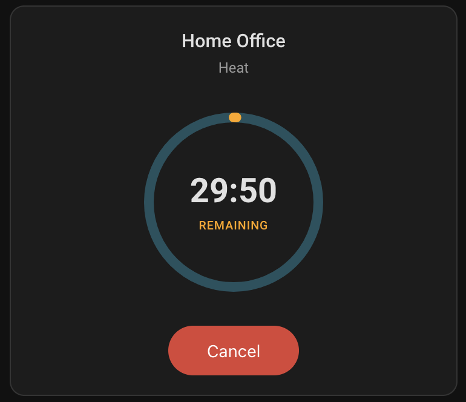
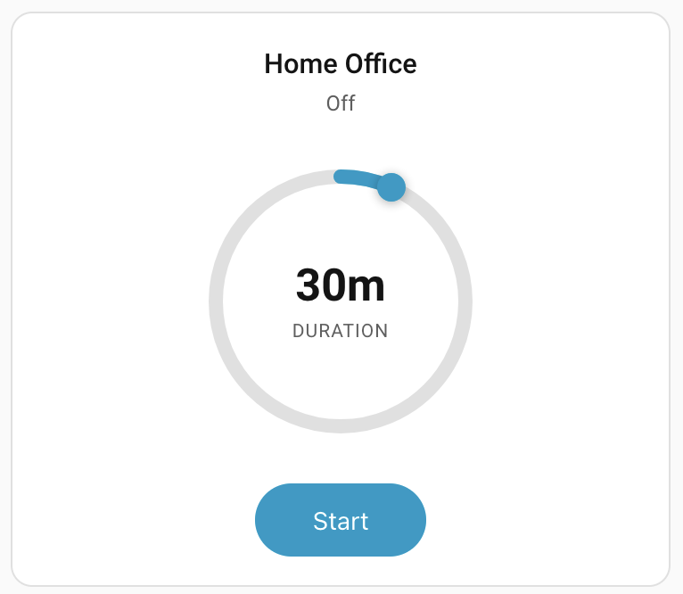
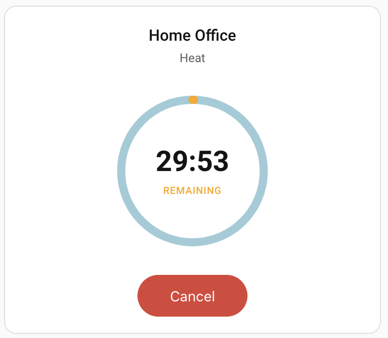
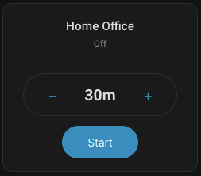
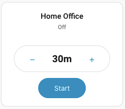
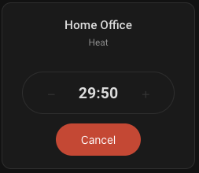
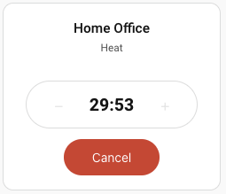

# Climate Timer Integration

[](https://github.com/hatools93/climate-timer-integration/actions/workflows/validate.yml)
[](https://github.com/hatools93/climate-timer-integration/actions/workflows/release.yml)
[](https://github.com/hacs/integration)
[](https://github.com/hatools93/climate-timer-integration/releases)
[](https://github.com/hatools93/climate-timer-integration/releases/latest)

A custom Home Assistant integration that runs any climate entity for a specified duration and automatically turns it off when the timer expires. Choose between a rotary dial or a simple button-based interface.

**The UI card and backend logic are bundled together as a single integration.** There is no need to install the frontend card separately — it is automatically registered when the integration is set up.

## Screenshots

### Dark Theme

| Timer Set | Timer Start State |
|---|---|
|  |  |

### Light Theme

| Timer Set | Timer Start State |
|---|---|
|  |  |

### Simple UI Mode

| Dark | Light |
|---|---|
|  |  |
|  |  |

## Features

- **All-in-one integration** — backend logic and Lovelace card are bundled together; no separate frontend installation required
- **Zero manual setup** — timer helpers are created and managed automatically per climate entity
- **Built-in auto-off** — the integration handles turning off the climate entity server-side when the timer finishes (no companion automation needed)
- **HVAC mode persistence** — remembers the last active HVAC mode and restores it on next start, without any extra helpers
- **Duration persistence** — remembers the last-used timer duration so it's pre-filled on the next run
- **Rotary dial UI** — drag, scroll, or swipe to set timer duration
- **Simple UI mode** — clean capsule-shaped button interface with [-] duration [+] controls
- **Real-time countdown** — animated elapsed arc with MM:SS display inside the dial
- **Reliable shutdown** — server-side timer survives browser disconnects
- **Rollback on failure** — if the timer fails to start, the climate entity is turned back off
- **External change awareness** — detects if the climate entity is turned off externally and cancels the timer
- **Activity logging** — all start, finish, and cancel events are logged to the HA Logbook
- **Configurable** — max duration, step size, show/hide name and state
- **Layout support** — works with HA grid resizing

## What's Different From the Card-Only Approach

The [Climate Timer Card](https://github.com/melanga/climate-timer-card) is a standalone Lovelace card that provides the timer UI but requires you to manually create timer helpers, input selects, and automations to handle the turn-off logic. This integration bundles everything together — no separate card install, no manual helpers, no extra automations.

| | Card-Only | This Integration |
|---|---|---|
| Frontend card install | Separate (HACS frontend or manual JS) | Bundled — auto-registered on setup |
| Timer helper | Manual creation required | Auto-created and managed |
| Turn-off automation | Required (blueprint provided) | Built-in, handled server-side |
| HVAC mode persistence | Required `input_select` helper | Built-in storage, no helpers needed |
| Configuration | `entity` + `timer_entity` + `mode_helper` | Just `entity` |

## Installation

### HACS (Recommended)

This integration is not yet in the HACS default repository. You can install it by adding it as a custom repository:

1. Open **HACS** in your Home Assistant instance
2. Click the **three-dot menu** (⋮) in the top-right corner and select **Custom repositories**
3. Paste the repository URL: `https://github.com/hatools93/climate-timer-integration`
4. Select **Integration** as the category and click **Add**
5. The repository will now appear in HACS — click **Download** to install it
6. Restart Home Assistant

### Manual

Copy the `custom_components/climate_timer` directory to your Home Assistant `config/custom_components/` directory:

```
config/custom_components/climate_timer/
```

Restart Home Assistant.

## Setup

1. Go to **Settings -> Devices & Services -> Add Integration**
2. Search for "Climate Timer"
3. Select the climate entity you want to control
4. Done — the integration will:
   - Create a managed timer helper automatically
   - Register the Lovelace card frontend
   - Handle turning off the climate entity when the timer finishes

You can repeat this for multiple climate entities.

## Adding the Card to Your Dashboard

After setup, add a new card to your dashboard and search for **"Climate Timer Integration Card"** in the card picker, or add via YAML:

```yaml
type: custom:climate-timer-integration-card
entity: climate.living_room_ac
```

That's it. No `timer_entity` or `mode_helper` configuration is needed — the integration manages everything automatically.

## Card Configuration

| Option | Type | Default | Description |
|--------|------|---------|-------------|
| `entity` | string | *required* | Climate entity ID |
| `max_duration` | string | `"4h"` | Maximum timer duration (e.g., "4h", "240m", "2h30m") |
| `step` | string | `"15m"` | Duration step size (e.g., "15m", "30m", "1h") |
| `show_name` | boolean | `true` | Show entity friendly name |
| `show_state` | boolean | `true` | Show climate entity state |
| `ui_mode` | string | `"rotary"` | UI style: `"rotary"` (dial) or `"simple"` (buttons) |

### Full Example

```yaml
type: custom:climate-timer-integration-card
entity: climate.bedroom_ac
max_duration: "2h"
step: "15m"
show_name: true
show_state: false
ui_mode: simple
```
## How It Works

1. **Select duration** — drag the rotary dial or tap [-]/[+] buttons to choose how long the climate should run
2. **Press Start** — the integration restores the last-known HVAC mode (if the entity is off), then starts the managed timer
3. **Countdown** — the card shows a live countdown, updating every second
4. **Auto-off** — when the timer finishes, the integration turns off the climate entity server-side
5. **Cancel** — press Cancel at any time to stop the timer and turn off the climate entity

The timer runs server-side, so even if you close the browser, the climate entity will be turned off when time is up.

### HVAC Mode Restoration

The integration automatically tracks the active HVAC mode whenever the climate entity changes state. When you start the timer while the entity is off, it restores the last-known mode without any extra configuration or helpers.

## Services

The integration exposes two services:

### `climate_timer.start`

Turns on the climate entity (restoring the last-known HVAC mode) and starts the managed timer.

| Field | Description |
|-------|-------------|
| `entity_id` | Climate entity to control |
| `duration` | Timer duration in HH:MM:SS format (e.g., `"01:30:00"`) |

### `climate_timer.cancel`

Cancels the running timer and turns off the climate entity.

| Field | Description |
|-------|-------------|
| `entity_id` | Climate entity to stop |

## Activity Logging

The integration logs all timer activity to the Home Assistant **Logbook**. You can view these entries under the Logbook panel or filter by "Climate Timer":

- **Timer started** — "started timer for Living Room AC with duration 01:30:00"
- **Timer finished** — "timer finished — turned off Living Room AC"
- **Timer cancelled** — "timer cancelled — turned off Living Room AC"

No additional configuration is needed — logbook entries appear automatically.

## Events for Automations

The integration fires custom events on the Home Assistant event bus that you can use as automation triggers. This lets you build additional workflows around the climate timer lifecycle.

### Available Events

| Event | Data | Description |
|-------|------|-------------|
| `climate_timer_started` | `entity_id`, `duration` | Fired when the timer starts successfully |
| `climate_timer_finished` | `entity_id` | Fired when the timer completes and the climate entity is turned off |
| `climate_timer_cancelled` | `entity_id` | Fired when the timer is manually cancelled |

### Automation Examples

**Send a notification when the timer finishes:**

```yaml
automation:
  - alias: "Notify when AC timer finishes"
    triggers:
      - trigger: event
        event_type: climate_timer_finished
        event_data:
          entity_id: climate.living_room_ac
    actions:
      - action: notify.mobile_app
        data:
          message: "Living room AC has been turned off by the timer."
```

**Close windows when the climate timer starts:**

```yaml
automation:
  - alias: "Close windows when AC starts on timer"
    triggers:
      - trigger: event
        event_type: climate_timer_started
    actions:
      - action: cover.close_cover
        target:
          entity_id: cover.living_room_window
```

**Log cancellations for energy tracking:**

```yaml
automation:
  - alias: "Log climate timer cancellations"
    triggers:
      - trigger: event
        event_type: climate_timer_cancelled
    actions:
      - action: logbook.log
        data:
          name: "Energy"
          message: "Climate timer was cancelled early for {{ trigger.event.data.entity_id }}"
```

You can test these events in **Developer Tools -> Events -> Listen to events**.

## Development

### Build

```bash
npm install
npm run build
```

This compiles the TypeScript frontend source into `dist/climate-timer-card.js` and copies it to `custom_components/climate_timer/frontend/`.

### Test

```bash
npm run test:run
```

### Tech Stack

- **Python** — Home Assistant custom integration (config flow, services, event listeners)
- **TypeScript** + **Lit** — Lovelace card frontend
- **Rollup** — ES module bundling
- **Vitest** + **fast-check** — property-based testing

## License

MIT
